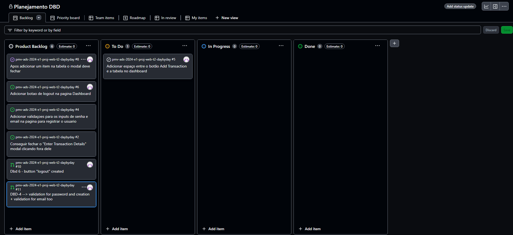

# Metodologia

## Gerenciamento de Projeto

A equipe utiliza metodologias ágeis, tendo escolhido o Scrum como base para definição do processo de desenvolvimento. Ele permite que as equipes respondam rapidamente às mudanças e entreguem continuamente valor ao cliente.

### Divisão de Papéis

A divisão de papéis do grupo baseada na divisão do SCRUM (Scrum Master, Product Owner e Equipe de Desenvolvimento) ficou da seguinte forma:

- Scrum Master: Bruno Monteiro Lima.
- Product Owner: Fellipe de Souza Montes.
- Equipe de Desenvolvimento: Bruno Monteiro Lima, Rafael de Almeida Chaia Toledo, Raynan Fernandes, Fellipe de Souza Montes.
- Equipe de Design: Bruno Monteiro Lima, Rafael de Almeida Chaia Toledo.

### Processo

A equipe está utilizando o GitHub para organização e estruturação das tarefas do projeto, com as seguintes listas:

<ul>
  <li>Product Backlog: Recebe as tarefas a serem trabalhadas e representa o Backlog do produto. Todas as atividades identificadas no decorrer do projeto são adicionadas a esta lista.</li>
  <li>To Do: Esta lista representa o Sprint Backlog que está sendo trabalhado.</li>
  <li>In progress: Lista das tarefas iniciadas.</li>
  <li>Done: Nesta lista são adicionadas as tarefas finalizadas e as que passaram pelos testes e controle de qualidade, prontas para serem entregues aos usuários.</li>
 </ul>

O quadro kanban do grupo no GitHub está disponível no link https://github.com/orgs/ICEI-PUC-Minas-PMV-ADS/projects/1083 e é apresentado, na figura abaixo:

<figure>
    
    <figcaption> Figura 1 - Tela do kanban do GitHub</figcaption>
</figure>

### Etiquetas

As tarefas são etiquetadas em função da propriedade da atividade e seguem o seguinte esquema de cores/categorias:

<ul>
  <li>Bug (Erro no código)</li>
  <li>Desenvolvimento (Development)</li>
  <li>Documentação (Documentation)</li>
  <li>Gerência de Projetos (Project Management)</li>
  <li>Infraestrutura (Infrastructure)</li>
  <li>Testes (Tests)</li>
</ul>

<figure> 
  
    <figcaption>Figura  02-  Esquema de cores e categorias utilizadas</figcaption>
</figure>

### Ferramentas

As ferramentas empregadas no projeto são:

- Editor de código: VsCode
- Ferramentas de comunicação: WhatsApp
- Ferramentas de desenho de tela (_wireframing_)

O editor de código foi escolhido porque ele possui uma integração com o sistema de versão. As ferramentas de comunicação utilizadas possuem integração semelhante e por isso foram selecionadas. Por fim, para criar diagramas utilizamos essa ferramenta por melhor captar as necessidades da nossa solução.

| AMBIENTE | PLATAFORMA |LINK DE ACESSO                 |
|--------------------|--------------------------------------------------------------------------------|----------------------------------------|
|Repositório de código fonte | GitHub | https://github.com/ICEI-PUC-Minas-PMV-ADS/pmv-ads-2024-e1-proj-web-t2-daybyday/blob/main/src/README.md |
|Documentos do projeto  | GitHub | https://github.com/ICEI-PUC-Minas-PMV-ADS/pmv-ads-2024-e1-proj-web-t2-daybyday |
|Projeto de interface e wireframes | Figma | https://www.figma.com/ |
|Gerenciamento do projeto  | GitHub | https://github.com/orgs/ICEI-PUC-Minas-PMV-ADS/projects/1083 |

