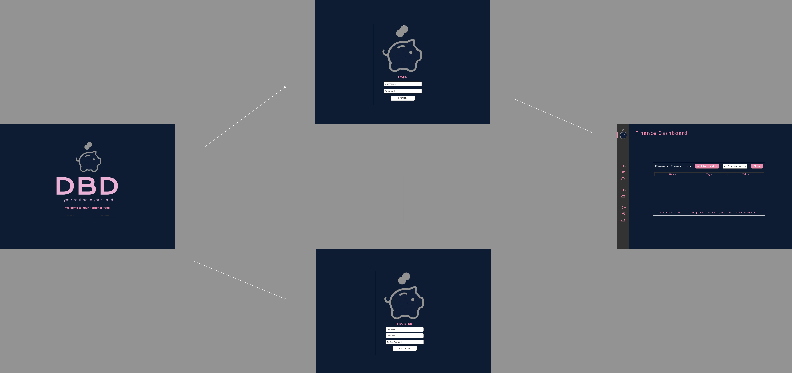
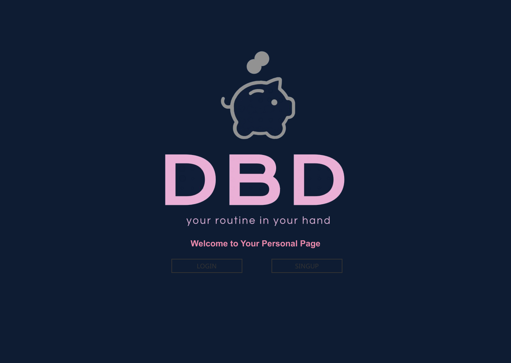
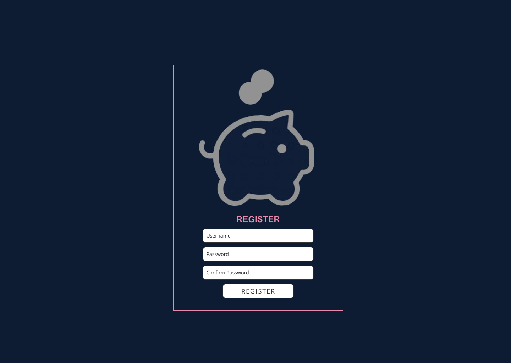
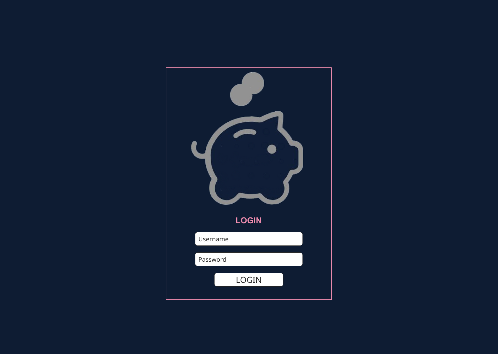
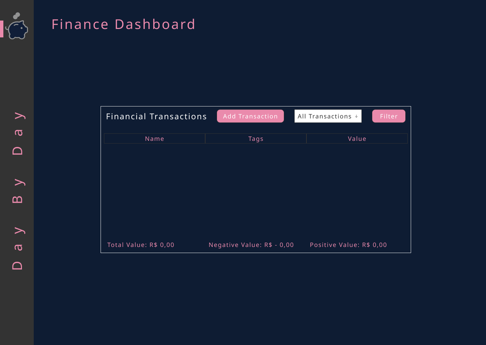

# Projeto de Interface

## User Flow

O User Flow cria o caminho que o usuário percorre ao interagir com telas do sistema. As setas indicam o fluxo seguido a partir da tela inicial do projeto:

  
Figura 1 - Fluxo de telas do usuário.

## Wireframes

### Tela - Página Inicial

A tela de página inicial apresenta o logotipo e os botões de "Login" e "SingUp".

  
Figura 2 - Tela da página inicial.

 

### Tela - Cadastro

A Tela de cadastro permite o usuário cadastrar uma conta no site.

  
Figura 3 - Tela de cadastro.

### Tela - Login

A Tela de login permite o usuário logar em uma conta no site.

  
Figura 4 - Tela de login

 

### Tela - Dashboard

A Tela de dashboard permite o usuário cadastrar/visualizar seus gastos ou receitas.

  
Figura 5 - Tela de Dashboard

 
